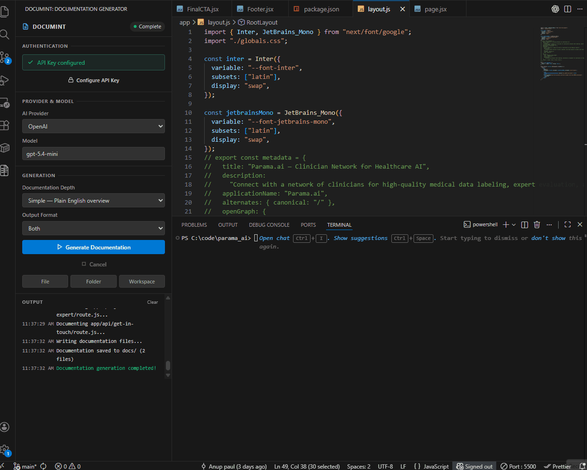
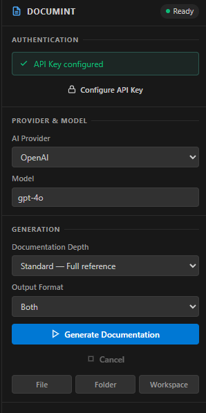

# DocuMint - AI Code Documentation Generator for VS Code


DocuMint is a VS Code extension that generates code documentation for an entire workspace, a selected folder, or a selected file using AI providers such as OpenAI, Anthropic, OpenRouter, Ollama, LM Studio, or a custom OpenAI-compatible endpoint.





It produces:

- `docs/documentation.md`
- `docs/documentation.html`

## Table of Contents

- [What It Does](#what-it-does)
- [What's New in 1.0.0](#whats-new-in-100)
- [How It Works](#how-it-works)
- [Supported Providers](#supported-providers)
- [Supported Languages](#supported-languages)
- [Install](#install)
- [Quick Start](#quick-start)
- [Commands](#commands)
- [Configuration](#configuration)
- [Output](#output)
- [Project Structure](#project-structure)
- [Development](#development)
- [Known Limitations](#known-limitations)
- [Contributing](#contributing)
- [License](#license)

## What It Does

DocuMint scans source files, sends code to the configured AI provider, and builds project-level documentation with:

- Project overview and stats
- Per-file documentation sections
- Detected imports, exports, symbols, and project links
- Quality notes when generated docs miss detected source facts
- Markdown and/or HTML output
- HTML table of contents with navigation and search
- Mermaid diagram rendering support in generated HTML

The extension runs directly inside VS Code through a sidebar webview.

## What's New in 1.0.0

DocuMint 1.0.2 improves documentation generation speed, cache reuse, and provider support.

- Smarter documentation: DocuMint now scans source code for real imports, exports, classes, functions, types, and TODO comments before asking AI to write docs.
- Better project understanding: generated docs include more accurate project context because DocuMint builds a simple project map first.
- Fewer fake details: generated sections are checked against detected source symbols, and DocuMint adds a quality note if important symbols are missing.
- Safer output: generated HTML escapes raw HTML from AI output and uses safer Mermaid rendering settings.
- Better workspace handling: folder/file generation now respects the selected workspace root, target languages, and exclude patterns.
- Real cancel support: pressing Cancel now stops active provider requests where supported.
- Safer cloud use: DocuMint asks before sending source code to cloud providers and blocks generation in untrusted workspaces.
- Smaller release package: the extension is bundled, so the VSIX ships fewer files.

## How It Works

1. Resolve provider and model from sidebar payload or VS Code settings.
2. Scan workspace files through `WorkspaceScanner`.
3. Optionally narrow generation to selected file/folder path.
4. Analyze source files for imports, exports, symbols, TODOs, and internal links.
5. Build a project map and file-level context from verified source facts.
6. Prepare local CPU context for each file, including dependency graph links, symbols, imports, and prompt inputs.
7. Generate detailed file documentation in parallel via the selected provider.
8. Validate generated docs against detected symbols.
9. Save output into `docs/` as Markdown, HTML, or both.

Core pipeline entry point: `src/services/docGenerator.ts`.

## Supported Providers

Configured using `aiDocGenerator.aiProvider`:

- `openai`
- `anthropic`
- `openrouter`
- `deepseek`
- `custom`
- `ollama`
- `lmstudio`

Provider implementations live in `src/providers/`.

## Supported Languages

Current workspace scanner settings can include:

- TypeScript (`.ts`, `.tsx`)
- JavaScript (`.js`, `.jsx`)
- Python (`.py`)
- Java (`.java`)
- C / C++ / C# (`.c`, `.cpp`, `.cs`)
- Go (`.go`)
- Rust (`.rs`)
- PHP (`.php`)
- Ruby (`.rb`)
- Swift (`.swift`)
- Kotlin (`.kt`)
- Scala (`.scala`)
- Shell, YAML, JSON, XML, HTML, CSS, SCSS, and SQL

Notes:

- `aiDocGenerator.targetLanguages` controls which languages are scanned.
- Exclusions include `node_modules`, `dist`, `build`, `.git`, `docs`, test/spec files, lockfiles, `.env` files, logs, and other common non-source artifacts.

## Install

### Marketplace

Install from VS Code Marketplace:

- https://marketplace.visualstudio.com/items?itemName=wonderertech.documint

Or run:

```text
ext install wonderertech.documint
```

### VSIX

```bash
code --install-extension documint-1.0.2.vsix
```

### Build from Source

```bash
git clone https://github.com/Wonderer-Tech/documint.git
cd documint
npm install
npm run compile
```

## Quick Start

1. Open a project folder in VS Code.
2. Open the **Documint** view in the activity bar.
3. Select provider and model.
4. Run **Configure API Key** if using a cloud provider.
5. Click **Generate Documentation** for workspace scope, or use **File** / **Folder** quick buttons.
6. Open generated files from `docs/`.

## Commands

Contributed commands:

- `aiDocGenerator.generateDocumentation` - Generate documentation
- `aiDocGenerator.cancelGeneration` - Cancel generation
- `aiDocGenerator.configureApiKey` - Configure API key

Internal scope commands used by sidebar:

- `aiDocGenerator.pickAndGenerateFile`
- `aiDocGenerator.pickAndGenerateFolder`

## Configuration

All settings are under `aiDocGenerator`.

### Key Settings

- `aiDocGenerator.aiProvider` (`openai` by default)
- `aiDocGenerator.model` (`gpt-4` by default)
- `aiDocGenerator.documentationDepth` (`simple | basic | standard | comprehensive`)
- `aiDocGenerator.outputFormat` (`markdown | html | both`)
- `aiDocGenerator.targetLanguages` (language hint list)
- `aiDocGenerator.maxTokens`
- `aiDocGenerator.temperature`
- `aiDocGenerator.rateLimitDelay`
- `aiDocGenerator.concurrentRequests`
- `aiDocGenerator.excludePatterns`
- `aiDocGenerator.customApiEndpoint`
- `aiDocGenerator.localModelUrl`
- `aiDocGenerator.localModelName`
- `aiDocGenerator.localModelTimeout`
- `aiDocGenerator.generateUmlDiagrams`
- `aiDocGenerator.enableDiffTracking`

### Example `settings.json`

```json
{
  "aiDocGenerator.aiProvider": "openai",
  "aiDocGenerator.model": "gpt-4o-mini",
  "aiDocGenerator.documentationDepth": "standard",
  "aiDocGenerator.outputFormat": "both",
  "aiDocGenerator.maxTokens": 4000,
  "aiDocGenerator.temperature": 0.3,
  "aiDocGenerator.concurrentRequests": 15,
  "aiDocGenerator.rateLimitDelay": 1000,
  "aiDocGenerator.excludePatterns": [
    "**/node_modules/**",
    "**/dist/**",
    "**/build/**",
    "**/.git/**"
  ],
  "aiDocGenerator.localModelUrl": "http://localhost:11434",
  "aiDocGenerator.localModelTimeout": 60000,
  "aiDocGenerator.generateUmlDiagrams": true,
  "aiDocGenerator.enableDiffTracking": true
}
```

DeepSeek example:

```json
{
  "aiDocGenerator.aiProvider": "deepseek",
  "aiDocGenerator.model": "deepseek-v4-flash"
}
```

## Output

Generated output is written to a `docs/` directory in the workspace root:

- `documentation.md`
- `documentation.html`

The HTML renderer includes:

- Sidebar TOC
- Section anchors
- Search
- Theme toggle
- Syntax highlighting
- Mermaid rendering
- Copy-to-clipboard for code blocks

## Project Structure

```text
src/
|-- analyzer/
|   `-- sourceAnalyzer.ts         # Static import/export/symbol discovery
|-- extension.ts                  # Activation and command wiring
|-- types.ts                      # Shared types and error models
|-- config/
|   |-- secretStorage.ts          # VS Code secret storage wrapper
|   `-- apiKeyConfiguration.ts    # API key configuration helper
|-- scanner/
|   `-- workspaceScanner.ts       # Workspace file discovery and filtering
|-- providers/
|   |-- aiProvider.ts             # Base provider and prompt/chunking pipeline
|   |-- providerFactory.ts        # Provider resolution and creation
|   |-- openaiProvider.ts
|   |-- anthropicProvider.ts
|   |-- openrouterProvider.ts
|   |-- deepseekProvider.ts
|   |-- ollamaProvider.ts
|   |-- lmstudioProvider.ts
|   `-- customProvider.ts
|-- services/
|   |-- docGenerator.ts           # Orchestration + writing docs output
|   |-- documentationValidator.ts # Checks generated docs against source facts
|   |-- htmlTemplate.ts           # Full HTML document template
|   `-- modelMetadataService.ts   # Context window metadata fetch/cache
`-- views/
    `-- sidebarProvider.ts        # Sidebar UI webview and state sync
```

## Development

### Prerequisites

- Node.js 18+
- npm 9+
- VS Code 1.110.0+

### Commands

```bash
npm install
npm run compile
npm run typecheck
npm run watch
npm test
```

Package extension:

```bash
npx @vscode/vsce package
```

## Known Limitations

- Static analysis is intentionally lightweight. It improves accuracy, but it is not a full compiler for every language.
- Documentation quality still depends on the selected AI model and the source code that is available in the workspace.
- Cloud providers receive selected source code after confirmation. Use Ollama, LM Studio, or a local custom endpoint when code must stay local.
- `aiDocGenerator.concurrentRequests` defaults to `15` for faster generation. Lower it in settings if your cloud provider rate-limits requests.
- Very large demo media can make the VSIX larger than the extension code itself.

## Contributing

Issues and PRs are welcome.

- Repository: https://github.com/Wonderer-Tech/documint
- Issues: https://github.com/Wonderer-Tech/documint/issues

## License

MIT. See [LICENSE](LICENSE).
